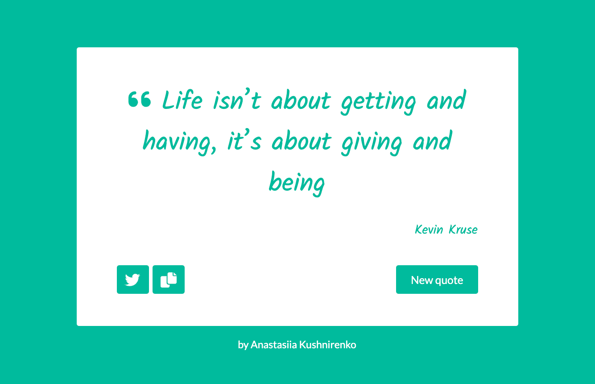
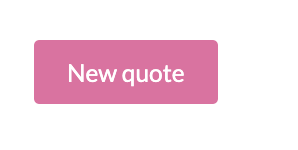
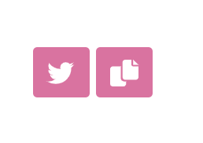

## Quote generator

The random quote generator that can be easily copied and shared via twitter.



## Installation and Setup Instructions
Clone down this repository. You will need node and npm installed globally on your machine.

Installation:  
```
npm install
```

To Start Server:  
```
npm start
```

To Visit App:  
```
localhost:3000
```

## Reflection
The project was created to put my front-end development skills to test what I've learned up to this point. I used a mix of HTML, JavaScript, JSX, CSS, Bootstrap, and React to complete it. 

The aim was to built an application that generates inspirational quotes. The quote can be copied to the clipboard and shared via twitter.

I chose the `create-react-app` boilerplate to minimize the initial setup and invest more time into writing the code. 

Working on this project, I built out a user interface with stateful components and create stateful context provider to store state data in a single location. I created a custom hook for making a fetch request and used `useRef` to get to the Twitter href attribute directly. I also used `useState` and `useEffect` to enhance rendering performance.

## How the app logic works

**Step 1**
On the first load, the quote machine displays a certain quote and its author.

**Step 2**
When the `new-quote` button is clicked, the app fetches a new quote and its author and displays them.
The background theme changes with each new quote.



**Step 3**
The current quote can be reposted to Twitter by clicking on the `tweet-quote` button. This element includes the `twitter.com/intent/tweet` path in its href attribute to tweet the current quote.

**Step 4**
The current quote can be copied to the clipboard by clicking on the `copy` button.



## Acknowledgments

[React Icons](https://react-icons.github.io/react-icons/ )  
[Bootstrap](https://getbootstrap.com/docs/4.0/getting-started/webpack/ )  